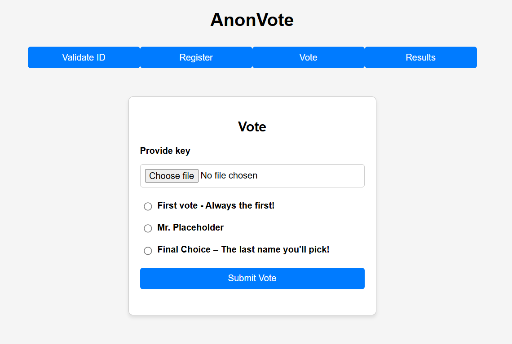

# Anonymous Voting Demo

This project is a demonstration of an anonymous voting system implemented in Rust. The primary goal is to explore Rust's capabilities, including multi-package communication, library features, testing, and gRPC integration. The project also utilizes the Chaum-Pedersen Zero-Knowledge Proof (ZKP) Protocol for cryptographic verification.

## Features
- **Chaum-Pedersen Zero-Knowledge Proof (ZKP) Protocol**
- **Multi-package Rust communication**
- **Rust library features**
- **Rust unit tests**
- **gRPC integration using `.proto` files**
- **Compiling Rust into WebAssembly (WASM) and integrating with JavaScript**

## Setup Instructions

### Prerequisites
Ensure you have the following dependencies installed:

1. **Rust** – Install from [rust-lang.org](https://www.rust-lang.org/tools/install)
2. **Node.js** – Install from [nodejs.org](https://nodejs.org/en/download)
3. **Protocol Buffers (`protoc`)** – Download from [GitHub](https://github.com/protocolbuffers/protobuf/releases) and add it to your system `PATH`

### Installation & Running the Application

#### Windows
1. Run the setup script:
   ```sh
   Setup.bat
   ```
2. Start the server:
   ```sh
   RunServer.bat
   ```
3. Start the client:
   ```sh
   RunClient.bat
   ```
4. Open the client in a web browser:
   ```
   http://localhost:3000
   ```

## How It Works
This application is a **learning project** and is not intended for real-world use. In a real scenario, ID validation and voter registration would be handled by an official authority, and voters would receive a **USB stick with a private key** for secure authentication.

### Preview


## License
This project is released under an open-source license for educational purposes.

